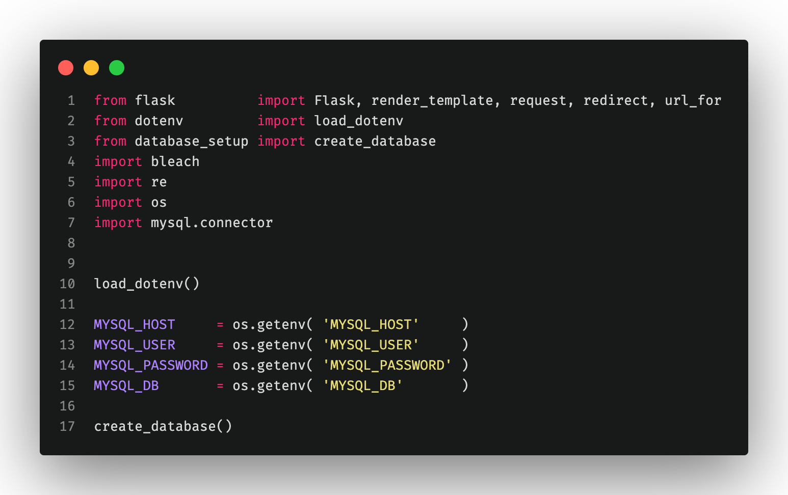

# flask-form

## Project: Form in Python with Flask

The company Hackers Poulette™ sells DIY kits and accessories for Rasperri Pi. They want to allow their users to contact their technical support. Your mission is to develop a Python script that displays a contact form and processes its response: sanitization, validation, and then sending feedback to the user.

 

## Tasks:

* If the user makes an error, the form should be returned to them with valid responses preserved in their respective input fields.
* Ideally, display error messages near their respective fields.
* The form will perform server-side sanitization and validation.
* If sanitization and validation are successful, a "Thank you for contacting us." page will be displayed, summarizing all the encoded information.
* Implementation of the honeypot anti-spam technique.

#### Form fields:
First name & last name + email + country (list) + message + gender (M/F) (Radio box) + 3 possible subjects (Repair, Order, Others) (checkboxes). All fields are mandatory, except for the subject (in this case, the value should be "Others").

 

## Explanations:

I did build three HTML pages: the home page, the contact form page, and the confirmation page when the form is successfully sent. I used Tailwind CSS for the style.

 

 

 

We can see here that I used the required field in HTML, triggering the popup when the field isn't filled.

 

If the user removes the required attribute or a problem occurs, there's still a backend code verification to see if everything is filled.

 

 

Here we start by importing what we need: Flask, Bleach (input sanitaze and validation), re. (for regex)
Then I declare my global variables and functions.

 

Here we can see Flask's route to manage the different routes. There is not much to say except for the "/submit" one, where we need to verify, collect, and save the information.

 

 

Now you can see my HTML pages. (notice the honeypot field at the end and the template syntax to show the errors)

 

 

 

## SQL

Now we will add some code to store the forms results into an SQL database.

Here are the new imports to allow us to use sql with Python.
I stored the credentials into a hidden .env file and we call them with Python dotenv librabry ( Don't forget to put your credentials in the .env file ).

 

I created another file to setup the database to make it more readable.

 

At the end of the submit function we add the SQL statements to store data into the database and we handle the errors.

 

And lastly, here's my html page to show the error message if we encouter a database error and the html code.

 

## Nosql

Here are the small code change to handle a Nosql database with MongoDB
We import the mongodb module and set a simple condition to choose between SQL or no sql database.

 

And here we also use the if condition and use the nosql syntax to store in the nosql database.

